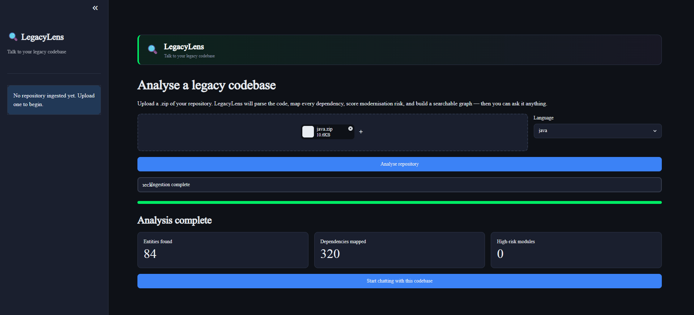
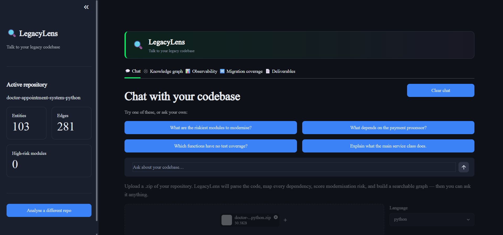
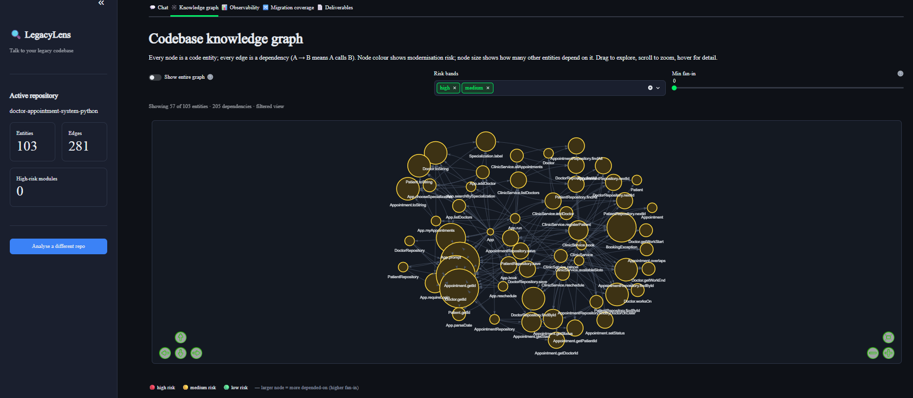
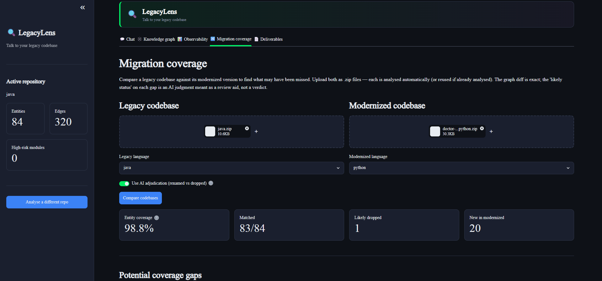
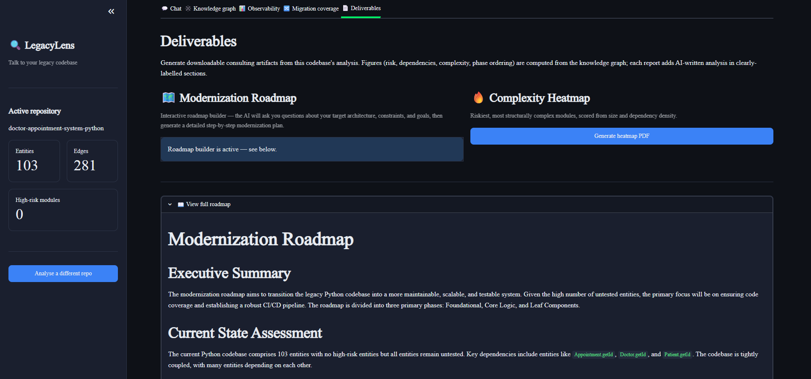
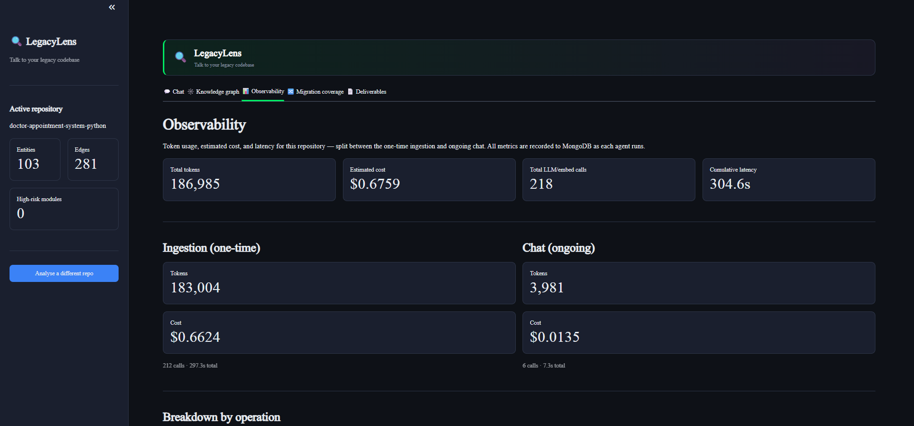
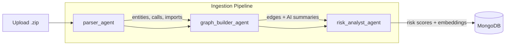

# 🔍 LegacyLens

**Talk to your legacy codebase.**

LegacyLens is an AI-powered platform for understanding and modernizing legacy code. Upload a codebase, and it parses the source, maps every dependency into a knowledge graph, scores each component for modernization risk, and lets you ask questions in plain English — with answers grounded in verifiable, cited facts from the graph.

It also generates consulting-grade deliverables (a step-by-step modernization roadmap and a complexity heatmap) and compares a legacy codebase against its modernized version to measure migration coverage.

---

## Table of Contents

- [What it does](#what-it-does)
- [Key features](#key-features)
- [Screenshots](#screenshots)
- [Architecture](#architecture)
- [Tech stack](#tech-stack)
- [Repository structure](#repository-structure)
- [Prerequisites](#prerequisites)
- [Setup](#setup)
- [Environment variables](#environment-variables)
- [MongoDB Atlas vector index](#mongodb-atlas-vector-index)
- [Running the app](#running-the-app)
- [Using LegacyLens](#using-legacylens)
- [How it works](#how-it-works)
- [Data model](#data-model)
- [Utility scripts](#utility-scripts)
- [Configuration & tuning](#configuration--tuning)
- [Troubleshooting](#troubleshooting)
- [Notes & limitations](#notes--limitations)

---

## What it does

Given a `.zip` of a **Python** or **Java** codebase, LegacyLens:

1. **Parses** the source into a semantic graph of *entities* (functions, classes, methods, interfaces) and their *dependencies* (call edges).
2. **Enriches** each entity with AI-written summaries (purpose, dependencies, modernization notes).
3. **Scores** each entity for modernization risk (0–100) from structural signals — fan-in, fan-out, size, and test coverage.
4. **Embeds** each entity into a vector index for semantic search.
5. Lets you **chat** with the codebase — dependency questions, risk questions, impact analysis, and free-form search — with every answer citing the exact entities and file/line ranges it used.
6. **Visualizes** the dependency graph interactively.
7. **Generates** a modernization roadmap (via an interactive Q&A) and a complexity heatmap as downloadable **PDFs**.
8. **Compares** a legacy repo against a modernized one to report migration coverage and dropped functionality.
9. **Tracks** token usage, cost, and latency across every LLM/embedding call.

Multiple codebases can coexist in one database and be switched between.

---

## Key features

| Feature | Description |
| --- | --- |
| **Grounded Q&A** | Answers cite the entity IDs and file/line ranges they're based on, plus a confidence badge (high / medium / low). |
| **Deterministic + AI hybrid** | Risk scores, dependency edges, and phase ordering are computed deterministically and are verifiable; AI prose is clearly labeled. |
| **Knowledge graph** | Interactive force-directed graph (vis-network) colored by risk and sized by fan-in. |
| **Interactive roadmap builder** | The AI asks up to 5 targeted questions (target stack, DB, deployment, timeline), then generates a detailed phased modernization plan. |
| **Migration coverage** | Three-layer matching (exact → fuzzy → embedding → optional LLM) to compare legacy vs. modernized repos. |
| **Observability** | Per-operation token/cost/latency dashboard. |
| **Persistent memory** | One conversation per codebase, restored across page reloads from MongoDB. |
| **MCP integration** | Open-ended questions are answered by an MCP agent that composes live MongoDB queries. |

---

## Screenshots

> Screenshots live in [`docs/screenshots/`](docs/screenshots/). Drop your captures into that folder using the filenames below (keep the names) and they'll render here automatically.

### Home — upload & analyse



### Chat — grounded Q&A



### Knowledge graph



### Migration coverage



### Deliverables — roadmap & heatmap



### Observability



---

## Architecture

LegacyLens is built on two [LangGraph](https://langchain-ai.github.io/langgraph/) pipelines that share a common `GraphState`.

### P1 — Ingestion pipeline (once per repo)
 


- **`parser_agent`** — walks the repo, extracts entities per file, stamps a stable `repo_id`, and persists entities.
- **`graph_builder_agent`** — resolves call edges deterministically and enriches each entity with three Claude-written summaries.
- **`risk_analyst_agent`** — computes risk scores and bands, then generates `voyage-code-3` embeddings for semantic search.

### P2 — Query pipeline (per question)

```mermaid
flowchart TD
    Q[User question] --> QA[qa_agent]
    QA --> I{Classify intent}
    I -->|risk| RANK[Top-risk query]
    I -->|dependency / impact| GL[MongoDB &#36;graphLookup]
    I -->|search / explain| VS[Atlas &#36;vectorSearch]
    RANK --> SYN
    GL --> SYN
    VS --> SYN
    MCP[MongoDB MCP agent] -.optional.-> SYN[Synthesize cited answer]
    SYN --> OUT[Answer + citations + confidence]
```



The `qa_agent` classifies intent, routes to the best retrieval strategy (risk ranking, graph traversal, or vector search), optionally augments with live MongoDB queries via MCP, and synthesizes a cited answer. Both intent classification and answer synthesis use structured output with automatic retry and a plain-text fallback for transient Bedrock tool-use errors.

---

## Tech stack

- **UI:** [Streamlit](https://streamlit.io/)
- **Orchestration:** [LangGraph](https://langchain-ai.github.io/langgraph/) (+ checkpointing)
- **LLM:** AWS Bedrock — Claude (via `langchain-aws`), default model `us.anthropic.claude-sonnet-4-6`
- **Embeddings:** [Voyage AI](https://www.voyageai.com/) `voyage-code-3` (1024-dim, code-specialized)
- **Database & vector search:** MongoDB Atlas (`$vectorSearch`, `$graphLookup`)
- **Live DB querying:** MongoDB MCP server (`mongodb-mcp-server` via `npx`) + `langchain-mcp-adapters`
- **Parsing:** Python `ast` (stdlib); Java `javalang` with a regex fallback
- **PDFs:** `reportlab`
- **Language:** Python 3.10+

---

## Repository structure

```
.
├── ui/                        # Streamlit front-end
│   ├── app.py                 # Entry point (streamlit run ui/app.py)
│   ├── ingestion_view.py      # Phase 1 — upload .zip & run ingestion
│   ├── chat_view.py           # Phase 2 — interactive grounded Q&A
│   ├── graph_view.py          # Interactive knowledge graph (vis-network)
│   ├── compare_view.py        # Legacy vs. modernized coverage report
│   ├── artifacts_view.py      # Roadmap builder + complexity heatmap PDFs
│   ├── observability_view.py  # Token / cost / latency dashboard
│   └── theme.py               # Global dark theme (CSS)
│
├── agents/                    # Pipeline nodes & services
│   ├── parser_agent.py        # P1: file discovery + entity extraction
│   ├── graph_builder_agent.py # P1: edge resolution + AI enrichment
│   ├── risk_analyst_agent.py  # P1: risk scoring + embeddings
│   ├── qa_agent.py            # P2: intent → retrieval → cited answer
│   ├── artifacts.py           # PDF deliverables (roadmap, heatmap)
│   ├── compare.py             # Migration-coverage comparison
│   ├── memory.py              # Persistent conversation memory
│   ├── mcp_context.py         # MongoDB MCP integration
│   └── observability.py       # Usage/cost logging
│
├── graph/                     # LangGraph wiring
│   ├── ingestion_pipeline.py  # P1: parser → graph_builder → risk_analyst
│   ├── query_pipeline.py      # P2: qa_agent
│   └── state.py               # Shared GraphState TypedDict
│
├── parsers/                   # Language parsers
│   ├── base.py                # Abstract parser + entity_id helpers
│   ├── python_parser.py       # AST-based Python parser
│   └── java_parser.py         # javalang parser (+ regex fallback)
│
├── db/                        # MongoDB layer
│   ├── client.py              # Singleton MongoClient (MONGO_URI)
│   ├── schema.py              # Collections, indexes, vector index setup
│   ├── collections.py         # Collection names & metadata helpers
│   └── checkpointer.py        # LangGraph MongoDB checkpointer
│
├── demo/                      # Sample codebases for a live demo
├── diagnose.py                # Inspect graph-readiness per repo
├── migrate_indexes.py         # Migrate to per-repo indexes (multi-repo)
├── reset_db.py                # Drop all collections for a fresh start
├── requirements.txt
└── .streamlit/config.toml     # Pinned dark theme + minimal toolbar
```

---

## Prerequisites

- **Python 3.10+**
- **Node.js** (provides `npx`, required for the MongoDB MCP server; optional if `MCP_DISABLE=1`)
- **MongoDB Atlas** cluster (M0 free tier works) with **Vector Search** enabled
- **AWS account** with **Bedrock** access to a Claude model in your region
- **Voyage AI** API key

---

## Setup

```powershell
# 1. Clone and enter the project
cd LL_final_hackathon

# 2. (Recommended) create a virtual environment
python -m venv .venv
.\.venv\Scripts\Activate.ps1        # Windows PowerShell
# source .venv/bin/activate         # macOS / Linux

# 3. Install dependencies
pip install -r requirements.txt

# 4. Create your .env file (see the next section)
```

Create a `.env` file in the project root with the variables below.

---

## Environment variables

| Variable | Required | Default | Purpose |
| --- | :---: | --- | --- |
| `MONGO_URI` | ✅ | — | MongoDB Atlas connection string |
| `AWS_ACCESS_KEY_ID` | ✅ | — | AWS credentials for Bedrock |
| `AWS_SECRET_ACCESS_KEY` | ✅ | — | AWS credentials for Bedrock |
| `AWS_REGION` | | `us-east-1` | Bedrock region |
| `BEDROCK_MODEL_ID` | | `us.anthropic.claude-sonnet-4-6` | Claude model / cross-region inference profile ID |
| `VOYAGE_API_KEY` | ✅ | — | Voyage AI embeddings key |
| `EMBED_SKIP` | | `0` | Set `1` to skip embeddings (risk/dependency Q&A still work; semantic search degrades) |
| `EMBED_DELAY_SECONDS` | | `21` | Delay between embedding batches (Voyage free tier ≈ 3 req/min) |
| `EMBED_TOKEN_BUDGET` | | `6000` | Tokens per embedding batch |
| `COMPARE_EMBED_THRESHOLD` | | `0.82` | Cosine similarity threshold for comparison matching |
| `MCP_DISABLE` | | `0` | Set `1` to disable the MongoDB MCP layer |
| `MCP_INIT_TIMEOUT_SECONDS` | | `120` | MCP subprocess init timeout |
| `MCP_QUERY_TIMEOUT_SECONDS` | | `45` | MCP per-query timeout |

Example `.env`:

```dotenv
MONGO_URI="mongodb+srv://<user>:<pass>@<cluster>.mongodb.net/?retryWrites=true&w=majority"
AWS_ACCESS_KEY_ID="AKIA..."
AWS_SECRET_ACCESS_KEY="..."
AWS_REGION="us-east-1"
BEDROCK_MODEL_ID="us.anthropic.claude-sonnet-4-6"
VOYAGE_API_KEY="pa-..."
```

> **Note:** `BEDROCK_MODEL_ID` must be a model your AWS account has access to in `AWS_REGION`. For Claude on Bedrock this is typically a **cross-region inference profile ID** (e.g. prefixed with `us.`).

---

## MongoDB Atlas vector index

Semantic search relies on an Atlas **Vector Search** index named `entity_vector_index` on the `entities` collection. Most standard indexes are created automatically at startup, but the vector index must exist on Atlas. Create it on the `legacylens.entities` collection:

```json
{
  "fields": [
    {
      "type": "vector",
      "path": "embedding",
      "numDimensions": 1024,
      "similarity": "cosine"
    },
    {
      "type": "filter",
      "path": "repo_id"
    }
  ]
}
```

If the vector index isn't ready yet, the app degrades gracefully — semantic search falls back to a risk-sorted query, and deterministic dependency/risk questions continue to work.

---

## Running the app

```powershell
streamlit run .\ui\app.py
```

Streamlit opens the app in your browser (default `http://localhost:8501`).

---

## Using LegacyLens

1. **Analyse a codebase** — On the home screen, upload a `.zip` of your repository, pick the language (Python/Java), and click **Analyse repository**. Watch the ingestion pipeline run stage by stage.
2. **Chat** — Ask questions like *"What are the riskiest modules?"*, *"What depends on the payment processor?"*, or *"What breaks if I change `TokenService`?"* Each answer cites the entities it used and shows a confidence badge.
3. **Knowledge graph** — Explore the dependency graph. Nodes are colored by risk and sized by how many other entities depend on them.
4. **Observability** — Review token usage, estimated cost, and latency per operation.
5. **Migration coverage** — Pick a legacy repo and its modernized counterpart to see coverage %, dropped functionality, and dependency diffs.
6. **Deliverables** — Build an interactive **Modernization Roadmap** (answer a few questions, or leave them blank to let the AI decide) and generate a **Complexity Heatmap**, both downloadable as PDFs.

---

## How it works

### Agents

| Agent | Pipeline | Responsibility |
| --- | --- | --- |
| `parser_agent` | P1 | Discovers source files, extracts entities (name, type, file, lines, calls, imports, tests, source), assigns a stable `repo_id`, persists entities. |
| `graph_builder_agent` | P1 | Resolves `calls` into dependency **edges** (deterministic name matching) and enriches each entity with Claude summaries. |
| `risk_analyst_agent` | P1 | Computes risk scores/bands from fan-in, fan-out, size, and test coverage; generates `voyage-code-3` embeddings. |
| `qa_agent` | P2 | Classifies intent, retrieves context (risk ranking / `$graphLookup` / `$vectorSearch` / MCP), synthesizes a cited answer, persists the turn, logs usage. |

### Risk scoring

Each entity's risk score (0–100) is a weighted, normalized blend of structural signals:

$$
\text{risk} = 100 \times \big(0.35\,\widehat{f_{in}} + 0.15\,\widehat{f_{out}} + 0.30\,\widehat{\text{no\_tests}} + 0.20\,\widehat{\text{size}}\big)
$$

where each term is normalized against the repo's maximum. Bands: **high** ≥ 70, **medium** 40–69, **low** < 40.

### Retrieval routing

- **risk** → highest-risk entities, sorted.
- **dependency / impact** (with a named target) → recursive `$graphLookup` upstream (callers) and downstream (callees).
- **search / explain** → Atlas `$vectorSearch` over entity embeddings (top-K = 6).
- **open-ended / whole-codebase** → MongoDB **MCP** agent composes live queries as the primary source, complemented by vector search for citations.

---

## Data model

All collections live in the `legacylens` database.

| Collection | One document per… | Notable fields |
| --- | --- | --- |
| `entities` | code entity | `entity_id`, `repo_id`, `type`, `file_path`, `line_start/end`, `calls[]`, `imports[]`, `has_tests`, `raw_source`, `risk_score`, `risk_band`, `fan_in`, `fan_out`, `embedding` (1024-dim), `summary_*` |
| `edges` | dependency (A→B) | `from_id`, `to_id`, `repo_id`, `edge_type` |
| `metadata` | ingested repo | `repo_id`, `repo_path`, `repo_name`, `language`, `entity_count`, `edge_count`, `high_risk_count`, `ingestion_done`, `updated_at` |
| `conversations` | chat turn | `session_id`, `repo_id`, `ts`, `question`, `answer`, `intent`, `cited_entities[]` |
| `usage` | LLM/embedding call | `repo_id`, `phase`, `operation`, `provider`, `input/output_tokens`, `cost_usd`, `latency_s`, `ts` |

Uniqueness is **per repo** (`repo_id + entity_id`, `repo_id + from_id + to_id`), so multiple codebases can safely coexist. LangGraph checkpoints are stored in a separate `legacylens_checkpoints` database for resumable ingestion.

---

## Utility scripts

```powershell
# Inspect what's ingested and whether each repo is graph-ready
python .\diagnose.py

# Migrate older databases to per-repo indexes (multi-repo support)
python .\migrate_indexes.py

# Drop all LegacyLens collections + checkpoints for a clean slate
python .\reset_db.py
```

---

## Configuration & tuning

- **Voyage free tier:** embeddings are paced to respect ~3 requests/min. Adjust `EMBED_DELAY_SECONDS`, `EMBED_TOKEN_BUDGET`, or set `EMBED_SKIP=1` to skip embeddings entirely on very large repos.
- **MCP:** set `MCP_DISABLE=1` if Node.js/`npx` isn't available; the QA agent falls back to deterministic retrieval.
- **Theme:** the app ships with a pinned dark theme in `.streamlit/config.toml`. Changing that file requires a full server restart.

---

## Troubleshooting

| Symptom | Fix |
| --- | --- |
| `MONGO_URI environment variable is not set` | Add `MONGO_URI` to your `.env`. |
| Semantic search returns weak results / warnings about the vector index | Create the `entity_vector_index` on Atlas (see above), and ensure embeddings ran (`EMBED_SKIP` not set to `1`). |
| Bedrock `AccessDenied` / model errors | Confirm your account has access to `BEDROCK_MODEL_ID` in `AWS_REGION`; Claude usually needs a cross-region inference profile ID. |
| `ModelErrorException: Model produced invalid sequence as part of ToolUse` | Handled automatically — the QA agent retries and falls back to a plain-text answer. If persistent, try a different `BEDROCK_MODEL_ID`. |
| MCP init fails / times out | Ensure Node.js is installed (`npx`), or set `MCP_DISABLE=1`. |
| Embedding rate-limit (429) errors | Increase `EMBED_DELAY_SECONDS` or lower `EMBED_TOKEN_BUDGET`. |

---

## Notes & limitations

- **Languages:** Python and Java are supported. Java uses `javalang` when available, with a lighter regex fallback.
- **Risk & complexity** are structural proxies (fan-in/out, size, test presence) — not full cyclomatic analysis — and are surfaced as decision support, not ground truth.
- **AI prose** in answers and PDFs is clearly labeled and intended as a starting point for expert review; the underlying figures are computed deterministically and are verifiable against the knowledge graph.
- Designed to run comfortably on **free-tier** services (Atlas M0, Voyage free tier), with pacing and graceful degradation throughout.
